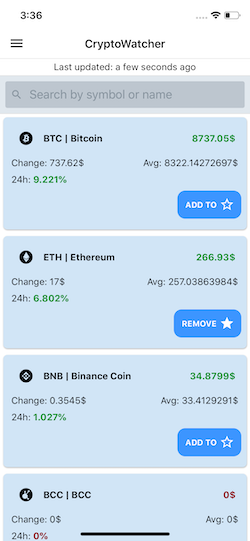
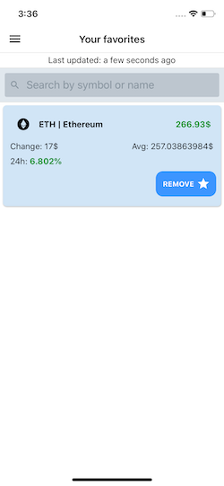
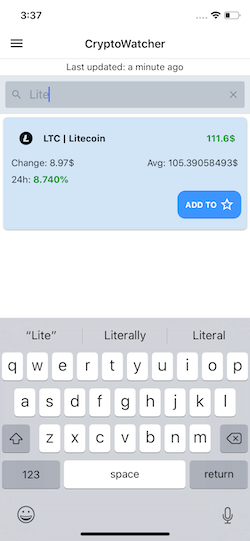
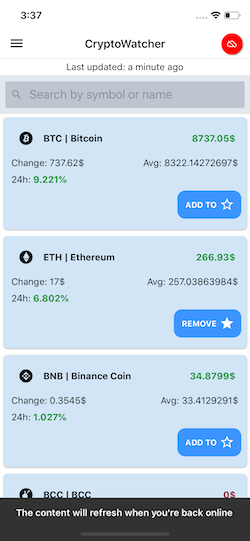
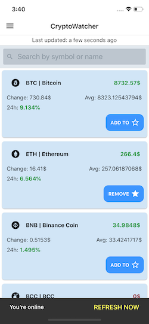

# CryptoWatcher

This is my practice test for the React Native developer position at Holded.



## Info
The app does mostly what the test requires. It has a list of crypto trading pairs. Because of the provided screenshots
as an example in the requirements PDF and to fit the style of it, the app only shows the pairs that trade a crypto coin
for USDT. This way, you see the price of the coin in US dollars. The app still pulls info for all the pairs so it could
be easily changed to all pairs.

The example screenshot showed 1h and 7d statistics, besides the 24h stats. I have not found the way to retrieve the 
former stats, so the app shows the stats available for 24h, which is the only available endpoint. Hourly and 7d
statistics could be pulled from the charts endpoint and multiple requests, but I assumed this amount of data fetching
and manipulation would be best suited for a backend server.

I have used the [Binance API](https://github.com/binance-exchange/binance-official-api-docs/blob/master/rest-api.md) but
not the `binance-api-node` wrapper, because it is not working correctly for React Native (It uses `crypto` node feature
which is not available in React Native's js context)

The user can add to favorites, remove, and see the top gainers between the crypto pairs.

CryptoWatcher has been developed in Typescript, using the `babel` typescript plugin/parser to transform it (does not use
the typescript compiler)
It was not necessary to integrate CocoaPods for the iOS project.
Code that has been taken from somewhere is noted through the code with source.


## Running the app
App has been tested both on Android and iOS.

To start everything up you'll need `yarn` or `npm`
If `node_modules` folder is not present:
```yarn install```

To run the app, use either of this commands
```$xslt
yarn ios //it will use default or open iOS simulator
yarn notch //uses iPhone Xs simulator. If not available try react-native run-ios --simulator="simulator_name"
yarn android //open an emulator first
```

Testing offline functionality is tricky in Android and iOS simulators.

For the Android emulator, best way is to open the extra settings -> Cellular -> Data status
and switch it from Home to None and vice versa. Flight mode will cut the connection with the development server.

For the iOS simulator, you have to deactivate the WiFi or network interface of the Mac system.
If the app takes longer than a second to detect the network change swipe down to reveal the status/lock screen and it
will work immediately. This is also a Simulator quirk.

If you want to build the apps in production mode, run them with Android Studio or Xcode. 

## Requirements
#### Redux is a must
CryptoWatcher uses Redux for state management and also for state persistence.
#### Expo is not allowed
No Expo used.
#### Store middleware
Besides from [redux-logger](https://github.com/LogRocket/redux-logger) for logging dispatched Redux actions on the
JS console, I used:
+ [redux-offline](https://github.com/redux-offline/redux-offline) to handle offline status and enqueuing:
    - Pros:
        - Keeps track of Network status (via RN's `NetInfo`) and exposes it in it's state reducer
        - Queueing of network requests for when network is not available with configurable queue reconciler
        - Bonus: if you dispatch an action with a URL and a HTTP method it will handle the network request for you
        - Persists by default the redux store using `redux-persist`. Note: I did not use it for the reason down below.
    - Cons:
        - Though extendable up to some degree, it can't handle chained requests and does not play well with redux-saga
        - Development on the library seems quite abandoned (although there's been some recent activity)
        - Uses `redux-persist` internally, but it uses its version 4 (released in 2017)
        - Uses `NetInfo` which is sometimes unreliable to detect network correctly, but you can provide your own 
        `networkDetect` function
+ [redux-persist](https://github.com/rt2zz/redux-persist) to persist the Redux store in RN's `AsyncStorage`
    - Pros: 
        - Seamless persistence of Redux store
        - v5+ has a React component (`PersistGate`) that suspends the App tree rendering until the store has been
        re-hydrated from the storage engine. This is why I have implemented `redux-persist` even though `redux-offline`
         already included v4 of this library.
        - Swappable storage engines
        - Migration system for store model updates
    - Cons:
        - With a super complex store model, handling of the merging of incoming state with initial state can get quite
         difficult. Only autoMergeLevel1 and autoMergeLevel2 are available.
         
I was going to use [redux-saga](https://github.com/redux-saga/redux-saga) but the complexity of the app did not require
 for it, the needed functionality could be done with other methods and anyway it didn't play nice with `redux-offline`
#### Offline functionality
All crypto information is stored offline. Users can see all data and the last time it was updated. Searching
functionality works offline too.

If the user is offline, a red crossed cloud icon will appear on the header bar indicating the user that he/she is
offline.

If the user tries to refresh while offline, a message will appear telling the user the content will be updated when
he/she is back online (and it will update). 

When the user is back offline, a message will appear informing that he/she's back online, with an option to refresh the 
data. If the user already tried to refresh while offline, the option does not appear, as it will refresh automatically.

#### Scalable project structure
I have opted for a feature based project structure.
The main structure is the following:
```
- src
  - api
  - features
    - feature_a
      - components
      - redux
      - screens
    - feature_b
      - components
      - redux
  - navigation
  - store
  - utilities
```
Every feature has it's own components, screens, and redux elements.

Navigation is handled outside of the features folder to integrate the different features. Features provide screens but
not the navigation logic between them. This makes it easy to swap or reorganize the app screen workflow without
affecting the functionality. Screens can provide navigation information for when they are placed in different navigation
structures. For example:
```
// Screen component
       static navigationOptions = (navProps: NavigationScreenProps): NavigationStackScreenOptions => ({
           ...createScreenHeaderOptions(navProps, 'Your favorites'),
       })
   
       static drawerNavigationOptions: NavigationDrawerScreenOptions = {
           drawerLabel: 'Favorites',
           drawerIcon: <Icon name="md-star" type="ionicon" />,
       }
```

`store` (Redux) is importing the reducers and actions that the features provide.

Note that feature-based structure does not mean module-based structure. Modules are independent and work individually
when used in a different place, the feature folders don't. Features can depend on one another, and if many features need
some common functionality, it can be provided by a common components folder.

This structure provides easier file navigation when maintaining code or developing new features.

The two areas that I have not prepared for are localization and theme/styling. Component styles are bundled in the
component file itself, and most of the string resources are hardcoded into the components, not localized. These two 
areas could have a huge improvement. I am still not convinced in a way to handle these two areas. (Native Android and
iOS resource bundling, theme providers? / all JS solution with style/text files mixed with the source code /
JS solution with all resource and localization files in a separate directory? )